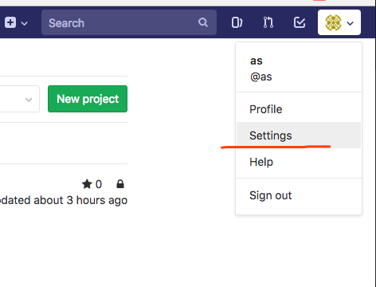
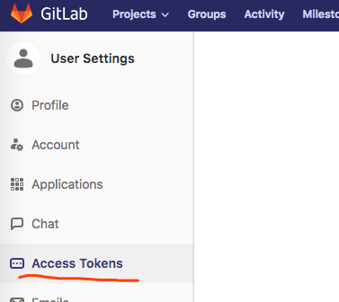
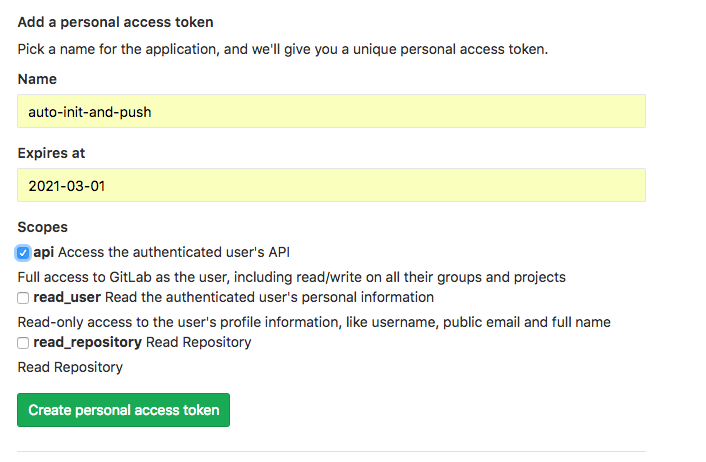
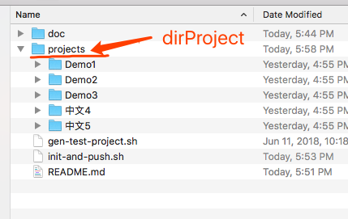
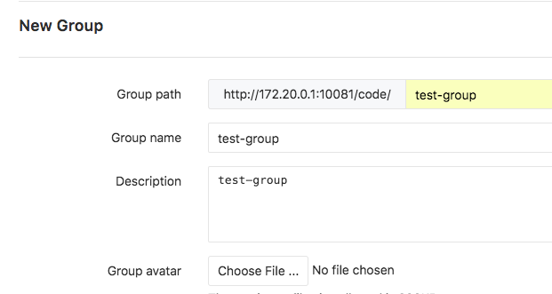
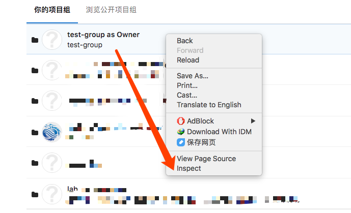
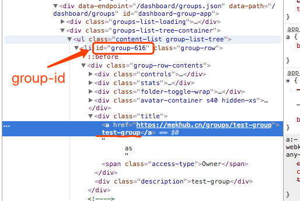

# Auto init and push project by folders 
requre pypinyin to transfer Chinese hanzi to pinyin for projectPath. It will auto install in the code or run 

```
pip install pypinyin
```

##How to config and use?

1. download
    ```
    git clone https://github.com/SNBQT/git-auto-init-and-push-by-folders.git
    cd git-auto-init-and-push-by-folders
    ```

1. config `.env` file by run below
    ```
    cp .env.example .env
    vi .env
    ```

    ```
    # Init params
    username=xx 
    useremail=xx@xxx.xx
    password=xxxxxx
    accesstoken=xxx

    # Group path, id
    grouppath=test-group
    grouppathId=35

    # domain or host
    domain=127.0.0.1:8888
    ```

1. acquire accesstoken

    

    

    
    
1. acquire Group path, id


    

    

    

    

1. run code

```
./init-and-push.sh
```